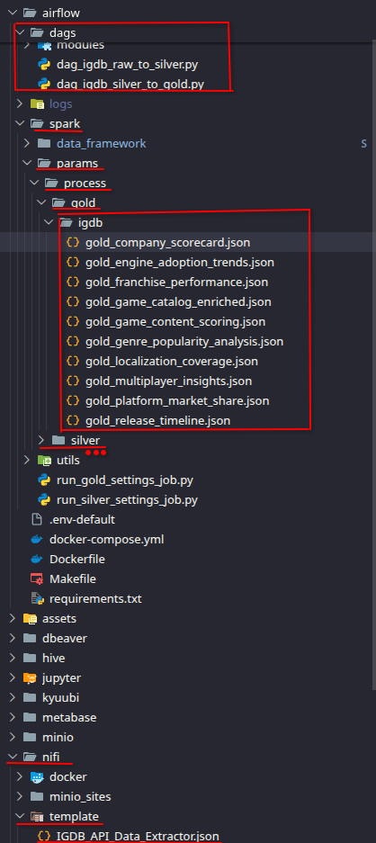
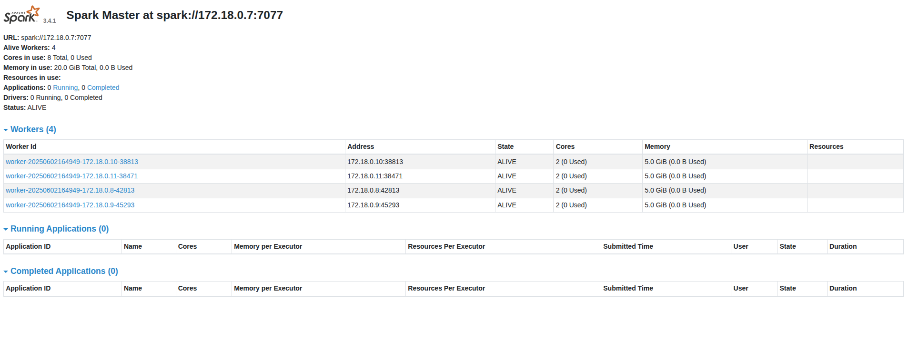
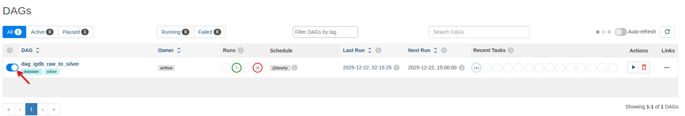
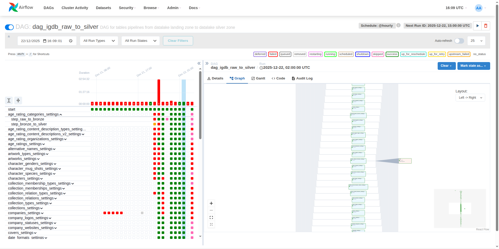
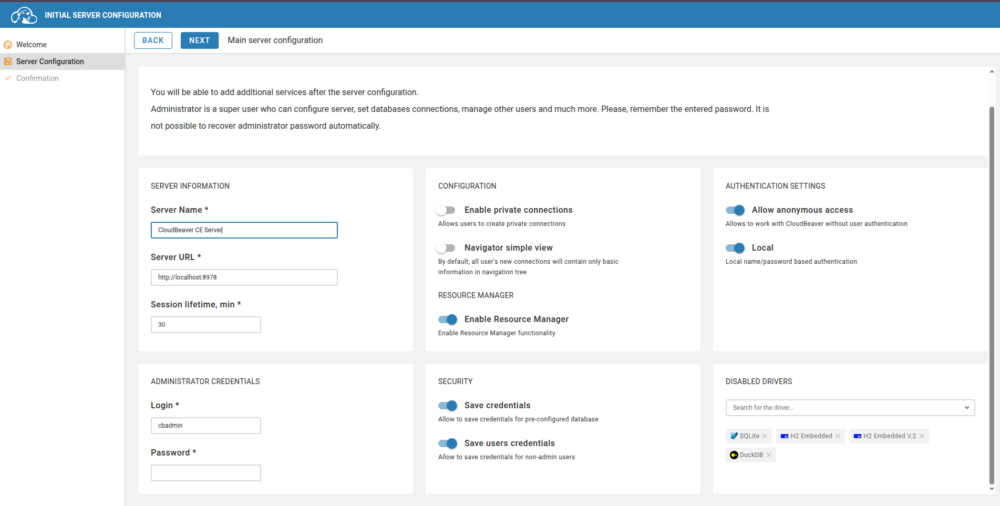

# 🚀 Open-Source Data Lakehouse Platform: Architecture Overview

This is a robust, fully open-source data platform designed for efficient data ingestion, processing, storage, and analytics. Built around a modern Data Lakehouse architecture, it integrates best-in-class services to provide a seamless, scalable, and governed data pipeline—from raw data collection to actionable business intelligence.


### 1. Data Ingestion Layer
The platform ingests data from diverse sources, including APIs (like IGDB), SFTP servers, external S3 buckets, and relational databases (JDBC). 

* **Apache NiFi:** Acts as the core ingestion engine, securely routing and transforming data in transit (via HTTPS).

### 2. Storage Layer (Delta Lake / MinIO)
At the heart of the platform is **MinIO**, serving as a highly performant, S3-compatible object storage system. It strictly adheres to the **Medallion Architecture** for progressive data refinement:

* **Landing/Bronze:** Raw data ingestion.
* **Silver:** Cleaned, filtered, and augmented data.
* **Gold:** Business-level aggregates ready for analytics.

### 3. Orchestration & Transformation
Pipelines are version-controlled via Git (utilizing Python and Jinja) and executed through a powerful orchestration layer.

* **Apache Airflow:** Orchestrates the entire data lifecycle using a distributed setup (CeleryExecutor, Redis broker, PostgreSQL metadata).
* **Apache Spark:** A dedicated cluster (Master + multiple Workers) handles heavy-duty, distributed data processing, reading and writing to MinIO via the Hadoop AWS S3A connector.

### 4. Data Catalog & Governance
Metadata management and data governance are centralized to ensure data quality and discoverability.

* **Unity Catalog:** Serves as the primary REST API catalog.
* **PostgreSQL & Hive Metastore:** Back the Unity Catalog, tracking schemas and managing tables across the data lake.

### 5. Distributed SQL Engine
**Trino** functions as the high-performance, distributed SQL query engine. 

* Configured with a Coordinator and multiple Worker nodes, it leverages the **Iceberg connector** and Unity Catalog REST API to query data directly from MinIO without needing to move it.

### 6. Visualization & Management
The top layer empowers analysts and business users to extract insights effortlessly.

* **Metabase:** Provides interactive dashboards and Business Intelligence (BI) capabilities.
* **DBeaver:** Offers a robust database management tool for direct SQL querying.

> **Note:** Both tools connect seamlessly to the underlying data lake via Trino JDBC.

## Initial Setup

> **Note:** This project uses its own framework as an auxiliary way to simplify the Spark process at the Airflow step

https://github.com/VictorLorenzo/data-framework ```You can use other ways to process your data if necessary```

### Data Framework - Git module
A PySpark-based ETL framework for processing data through a medallion architecture (Raw → Bronze → Silver → Gold). Built on top of Apache Spark, Delta Lake, and Unity Catalog, with Iceberg compatibility via Delta UniForm.

* Run the command
  ```sh
  git submodule update --init --recursive
  ```

### Choose your project (#Notice: Right now the only project available is igdb-pipeline)
At my GitHub you can find pipeline configurations for all kinds of data: https://github.com/VictorLorenzo. The configurations are:
* Airflow python orchestration: ```/{PROJECT}/airflow/dags/{PYTHON_SCRIPT}```
* json silver templates for the data-framework: ```/{PROJECT}/airflow/spark/params/process/silver/{PIPELINE}```
* json gold templates for the data-framework: ```/{PROJECT}/airflow/spark/params/process/gold/{PIPELINE}```
* NiFi data ingestion templates: ```/{PROJECT}/nifi/templates/{TEMPLATES}```

You need to copy & paste those files at their respective directories at the data platform



### All services must be started in the order below:

#### 0. Network

For the data platform services to communicate with each other, they need a network

```sh
make network-create NETWORK=data-platform
```

#### 1. SFTP – Secure file transfer for ingesting raw data.(optional)

* Run the command at the terminal to start the container
  ```sh
  cd sftp && make up
  ```

#### 2. MinIO – Object storage for scalable data management.

* Run the command at the terminal to start the container

  ```sh
  cd ../minio && make up
  ```
* Access the url http://localhost:9001/login
* Minio credentials

  ```
  user: accesskey
  password: secretkey
  ```
* At the minio UI, access the "Access Key" menu
  
* Create an Access Key with this credentials

  ```
  accessKey: nifi,
  secretKey: nifipass,
  ```

  ```
  Access Key: trino
  Secret Key: trinopass
  ```
  

#### 3. NiFi – Automates data movement, ingestion and transformation.
* Run the command at the terminal to start the container

  ```sh
  cd ../nifi && make up
  ```

**WARNING:** Each pipeline project has its own way to handle ingestion. You can read the ```README.md``` from the chosen pipeline project for a better understanding.

#### 4. Unity Catalog – Open-source data catalog with 3-level namespace (catalog.schema.table) for unified data governance.

* Run the command at the terminal to start the containers
  ```sh
  cd ../unity-catalog && make up
  ```
* Wait for the init container to finish (creates medallion catalogs and schemas automatically)
* Access the Unity Catalog UI at http://localhost:3001
* Access the REST API at http://localhost:8087/api/2.1/unity-catalog/catalogs
* Access the Swagger docs at http://localhost:8087/docs/#/
  ```
  Catalogs created: landing, bronze, silver, gold
  Schemas: default (in each catalog)
  ```

#### 5. Spark – Distributed data processing and analytics engine (Spark 3.5.3 + Delta Lake 3.2.1).

* Run the command at the terminal to start the containers

  ```sh
  cd ../spark && make up
  ```
* Access http://localhost:8082/ to watch your spark workers
  
* Spark is pre-configured with Unity Catalog as the default catalog
* Access http://localhost:18080/ to see the process history

#### 6. Airflow – Workflow orchestration platform for authoring, scheduling, and monitoring data pipelines.

* Run the command at the terminal to start the container

  ```sh
  cd ../airflow && make up
  ```
* Access the url http://localhost:8080/login/

  ```
  user: airflow
  pass: airflow
  ```

Important for executing Spark jobs.

Configure the Spark connection: In Airflow, go to Admin -> Connections and add a new connection. Set the Conn Id as spark_default, the Conn Type as Spark, and the Host as the address of your Spark master.
```
Connection Id: spark_default
Connection Type: Spark
Host: spark://spark-master
Port: 7077
```

Configure the airflow pools: In Airflow, go to Admin -> Pools and add a new pool. You can add more pools depending on the number of Spark Workers you have.
```
Pool: spark_local_pool
Slots: 4
Description: Limits concurrent Spark driver submissions to protect local system resources.
```


* Run your pipeline
  
  

#### 7. Trino – Distributed SQL query engine for fast, interactive analytics across multiple data sources.

> **Note:** The Trino coordinator uses file-based password authentication. Both the `password.db` and the `.env` files are **gitignored** because they contain credentials, so you must create them locally before starting the container.

* Create the env file `trino/.env` (template available at `trino/.env.example`). The `TRINO_SHARED_SECRET` is required because authentication is enabled — coordinator and workers must share the same secret to communicate internally.
  ```sh
  cp trino/.env.example trino/.env
  # Generate a strong shared secret and write it into trino/.env
  echo "TRINO_SHARED_SECRET=$(openssl rand -base64 32)" >> trino/.env
  ```
  Final `trino/.env` should look like:
  ```env
  CATALOG_MANAGEMENT=dynamic
  TRINO_SHARED_SECRET=<base64-random-32-bytes>
  ```

* Create the password file `trino/config/coordinator/password.db` with a bcrypt-hashed entry per user (format: `username:bcrypt_hash`). You can generate it with `htpasswd` (Apache utils) via Docker — no local install required:
  ```sh
  # Replace <USER> and <PASSWORD> with your values
  docker run --rm httpd:2.4-alpine htpasswd -nbB -C 10 <USER> '<PASSWORD>' \
    > trino/config/coordinator/password.db
  ```
  Example (creates user `admin`):
  ```sh
  docker run --rm httpd:2.4-alpine htpasswd -nbB -C 10 admin 'Tr1n0@dm1n#2026' \
    > trino/config/coordinator/password.db
  ```
  The resulting file should look like:
  ```
  admin:$2y$10$uj135m9VWxM/BEjHsrtFsucJY1gmDGvHsBNF4Wr/qmqX07TlOjtOK
  ```
  > **Security:** `bcrypt` is a one-way hash — the original password cannot be recovered. Keep a record of it in a password manager. To add more users, append new lines to the same file. Trino reloads it every 30s (`file.refresh-period=30s`).

* Run the command at the terminal to start the container
  ```sh
  cd ../trino && make up
  ```
* Access http://localhost:8099/ui/ to see the cluster overview, using the credentials you defined above (example credentials from the snippet above):
  ```
  user: admin
  password: Tr1n0@dm1n#2026
  ```

#### 8. DBeaver – Database management and visualization tool.
* Run the command at the terminal to start the container
  ```sh
  cd ../dbeaver && make up
  ```

* Access http://localhost:8978/#/

* Choose a password and click next
  

* At the Top left corner click "+" --> "New Connection" and search for the Trino Connection

* Credentials:
  ```
  Driver: Trino
  Host: trino-coordinator
  port: 8080
  user: admin
  password: Tr1n0@dm1n#2026
  ```

* Now you're connected to the Unity Catalog
  

#### 9. Metabase – Open-source business intelligence tool for exploring, visualizing, and sharing data insights.
* Run the command at the terminal to start the container
  ```sh
  cd ../metabase && make up
  ```

* Access http://localhost:3000/

* Credentials:
  ```
  Host: trino-coordinator
  port: 8080
  user: admin
  password: Tr1n0@dm1n#2026
  ```

#### 10. Jupyter – Interactive computing environment for creating and sharing documents with live code, visualizations, and narrative text.

#### 11. Kyuubi – Distributed multi-tenant JDBC server for Apache Spark.

#### 12. Kafka – Distributed event streaming platform for building real-time data pipelines and applications.

#### 13. Debezium – Distributed platform for change data capture (CDC), streaming real-time changes from databases to other systems.

### More TODO
In the future I want to implement some ideas to automate some processes:

* ~~Use Unity Catalog for data governance and data quality, also as catalog~~ ☑️ (Implemented - Unity Catalog OSS)

* Implement a more generic way to upload your ETL pipeline using json with jinja2 ☑️(Project in Beta)

* Add more data graphics

* Add more data integration such as with steam API ☑️(Project in Beta)

* Implement CI/CD process to upload your pipeline without committing any new code

* Add more new features from Databricks

* Add compatibility with AWS and Databricks

* Create a clustered environment using Kubernetes